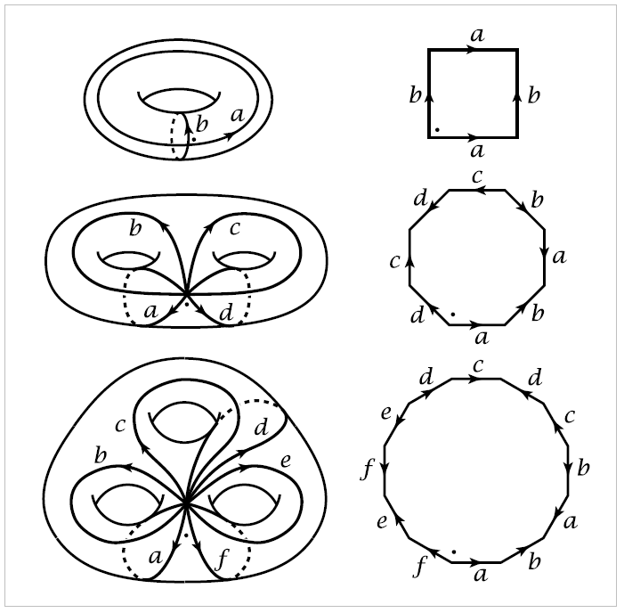

Cell complexes
==============

A familiar way of constructing the torus :math:`S^1 \times S^1` is by identifying opposite isdes 
of a square. More generally, an orientable surface :math:`M_g` of  genus :math:`g` can be constructed 
from a polygon with :math:`4g` sides by identifying pairs of edges, as shown in the figure in the first three cases :math:`g=1,2,3`.

The :math:`4g` edges of the polygon become a union of :math:`2g` circles in the surface, all intersecting 
in a single point. The interior of the polygon ccan be thought of as an open disk, or a :math:`\mathbf{2}`-**cell**,
attached to the union of the :math:`2g` circles. One can also regard the union of the circles as being obtained 
from their common point of intersection, by attaching :math:`2g` open arcs, or :math:`\mathbf{1}`-**cells**. Thus 
the surface can be built up in stages: Start with a point, attach :math:`1`-cells to this point, 
then attach a :math:`2`-cell.

A natural generalization of this is to construct a space by the following procedure:

1. Start with a discrete Set :math:`X^0`, whose points are regarded as :math:`0`-cells.
2. Inductively, form the :math:`\mathbf{n}`-**skeleton** :math:`X^n` from :math:`X^{n-1}` by attaching :math:`n`-cells :math:`e^n_{\alpha}` via maps 
:math:`\varphi_\alpha:S^{n-1} \rightarrow X^{n-1}`. This means that :math:`X^n` is the quotient space of the disjoint union 
:math:`X^{n-1}\sqcup_\alpha D^n_\alpha` with a collection of :math:`n`-disks :math:`D^n_\alpha` under the identifications
:math:`x~\varphi_\alpha(x)` for :math:`x \in \partial D^n_\alpha`. Thus as a set, :math:`X^n=X^{n-1}\sqcup_\alpha e^n_\alpha` where each :math:`e^n_\alpha` is an
open :math:`n`-disk.
3. One can either stop this inductive

It is true in general that two spaces :math:`X` and :math:`Y` are homotopy equivalent if and only
if there exists a third space :math:`Z` containing both :math:`X` and :math:`Y` as deformation retracts. For 
the less trivial implication one can in fact take :math:`Z` to be the mapping cylinder :math:`M_f` deformation
retracts to :math:`Y`, so what needs to be proved is that :math:`M_f` also deformation retracts to its
other end :math:`X` if :math:`f` is a homotopy equivalence. This is shown in Corollary 0.21.

If :math:`X=X^n` for some :math:`n`, then :math:`X` is said to be finite-dimensional, and the smallest
such :math:`n` is the **dimension** of :math:`X`, the maximum dimension of cells of :math:`X`.

**Example 0.1.** A :math:`1`-dimensional cell complex :math:`X=X^1` is what is called a **graph** in 
algebraic topology. It consists of vertices (the :math:`0`-cells) to which edges (the :math:`1`-cells) are
attached. The two ends of an edge can be attached to the same vertex.

**Example 0.2.** The house with two rooms, pictured earlier, has a visually obvious 
:math:`2`-dimensional cell complex structure. The :math:`0`-cells are the vertices where three or more 
of the depicted edges meet, and the :math:`1`-cells are the interiors of the edges connecting
theses vertices. This gives the :math:`1`-skeleton :math:`X^1`, and the :math:`2`-cells are the components of 
the remainder of the space, :math:`X-X^1`. If one counts up, one finds there are :math:`29` :math:`0`-cells,
:math:`51` :math:`1`-cells, and :math:`23` :math:`2`-cells, with the alternating sum :math:`29-51+23` equal to :math:`1`. This is 
the **Euler characteristic**, which for a cell complex with finitely many cells is defined 
to be the number of even-dimensional cells minus the number of odd-dimensional 
cells. As we shall show in Theorem 2.44, the Euler characteristic of a cell complex 
depends only on its homotopy type, so the fact that the house with two rooms has the 
homotopy type of a point implies that its Euler characteristic must be :math:`1`, no matter 
how it is represented as a cell complex.

**Example 0.3.** The sphere :math:`S^n` has the structure of a cell complex with just two cells, :math:`e^0` 
and :math:`e^n`, the :math:`n`-cell being attached by the constant map :math:`S^{n-1}\rightarrow e^0`. This is equivalent 
to regarding :math:`S^n` as the quotient space :math:`D^n/\partial D^n` 