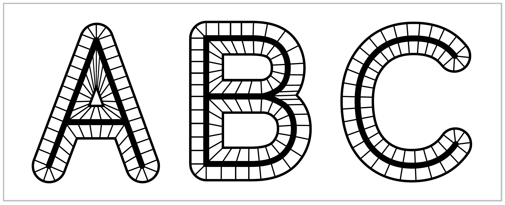
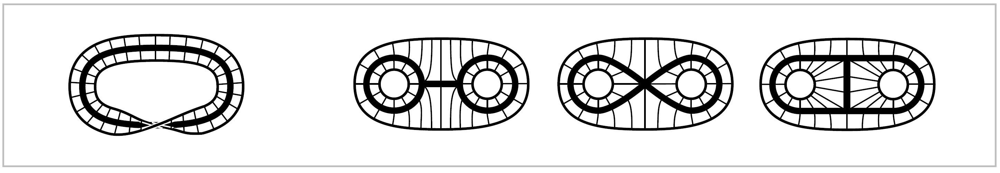

Homotopy and Homotopy Type
==========================

One of the main ideas of algebraic topology is to consider two spaces to be equivalent 
if they have 'the same shape' in a sense that is much broader than homeomorphism. 
To take an everyday example, the letters of the alphabet can be written either as unions of finitely many straight 
and curved line segments, or in thickened forms that are compact regions in the plane bounded by one or more simple closed curves. 
In each case the thin letter is a subspace of the thick letter, and we can continuously shrink the thick letter to the thin one. 
A nice way to do this is to decompse a thick letter, call it **X**, into line segments connecting each point on the outer boundary of **X** to a unique point of the think subletter X, 
as indicated in the figure. Then we can shrink **X** to X by sliding each point of **X**-X into X along the line segment that contains it. 
Points that are already X do not move.

We can think of this shrinking process as taking place during a time interval :math:`0 \leq t \leq 1`, and then it defines a family of functions 
:math:`f_t`: **X** :math:`\rightarrow` **X** parametrized by :math:`t \in I=[0,1]`, where :math:`f_t(x)` is the point to which a given point 
:math:`x \in \textbf{X}` has moved at time :math:`t`. Naturally we would like :math:`f_t(x)` depend continuously on both :math:`t` and :math:`x`, 
and this will be true if we have each :math:`x \in` **X** - X move along its line segment at constant speed so as to reach its image point in X at time :math:`t=1`, 
while points :math:`x \in` X are stationary, as remarked earlier.

Examples of this sort lead to the following general definition. A **deformation retraction** of a space :math:`X` onto a subspace :math:`a` is a family of maps 
:math:`X\rightarrow X, \,  t \in I`, such that :math:`f_0=\mathbb{1}` (the identity map), :math:`f_1(X)=A`, and :math:`f_t \mid A = \mathbb{1}` for all :math:`t`. 
The family :math:`f_t` should be continuous in the sense that the associated map :math:`X\times I \rightarrow X, \, (x,t) \mapsto f_t(x)`, is continuous.

It is easy to produce many more examples similar to the letter examples, with the deformation retraction :math:`f_t` obtained by sliding along line segments. 
The figure on the left below shows such a deformation retraction of a Möbius band onto its core circle.

The three figures on the right show deformation retractions in which a disk with two smaller open subdisks removed shrinks to three different subspaces.