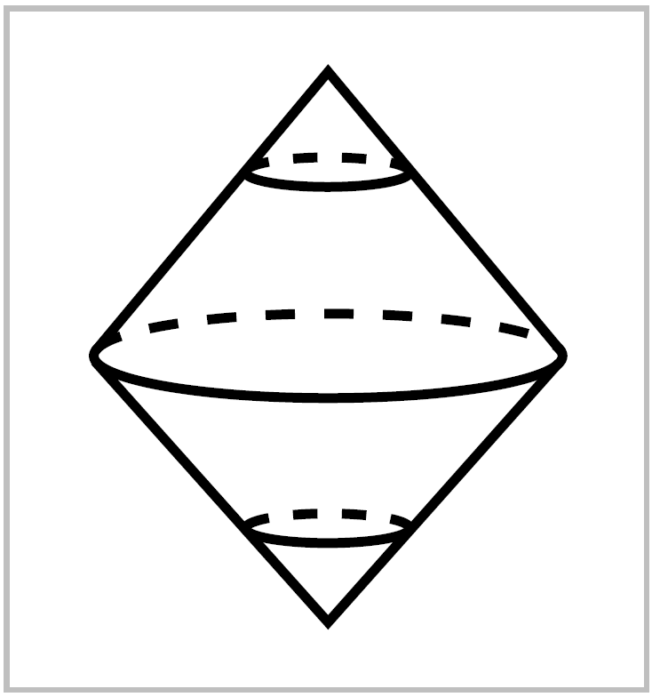

Operations on Spaces
====================

Cell complexes have a very nice mixture of rigidity and flexibility, with enough 
rigidity to allow many arguments to proceed in a combinatorial cell-by-cell fashion 
and enough flexibility to allow many natural constructions to be performed on them. 
Here are some of those constructions. 

.. container:: no-indent

    **Products**. If :math:`X` and :math:`Y` are cell complexes, then :math:`Y \times Y` has the structure of a cell 
    complex with cells the products :math:`e^m_\alpha \times e^n_\beta` where :math:`e^m_\alpha` ranges over the cells of :math:`X` and 
    :math:`e^n_\beta` ranges over the cells of :math:`Y`. For example, the cell structure on the torus :math:`S^1 \times S^1` 
    described at the beginning of this section is obtained in this way from the standard 
    cell structure on :math:`S^1`. For completely general CW complexes :math:`X` and :math:`Y` there is one 
    small complication: The topology on :math:`X \times Y` as a cell complex is sometimes finer than 
    the prouct topology, with more open sets than the product topology has, though the 
    two topologies coincide if either :math:`X` or :math:`Y` has only finitely many cells, or if both :math:`X` 
    and :math:`Y` have countably many cells. This is explained in the Appendix. In practice this 
    subtle issue of point-set topology rarely causes problems, however.

.. container:: no-indent-no-margin

    **Quotients**. If :math:`(X,A)` is a CW pair consisting of a cell complex :math:`X` and a subcomples :math:`A`, 
    then the quotient space :math:`X / A` inherits a natural cell complex structure from :math:`X`. The 
    cells of :math:`X/A` are the cells of :math:`X-A` plus one new :math:`0`-cell, the image of :math:`A` in :math:`X/A`. For a 
    cell :math:`e^n_\alpha` of :math:`X-A` attached by :math:`\varphi_\alpha : S^{n-1} \rightarrow X^{n-1}`, the attaching map for the corresponding 
    cell in :math:`X/A` is the composition :math:`S^{n-1} \rightarrow X^{n-1}\rightarrow X^{n-1}/A^{n-1}`.

For example, if we give :math:`S^{n-1}` any cell structure and build :math:`D^n` from :math:`S^{n-1}` by attaching 
an :math:`n`-cell, then the quotient :math:`D^n / S^{n-1}` is :math:`S^n` with its usual cell structure. As another 
example, take :math:`X` to be a closed orientable surface with the cell structure described at 
the beginning of this section, with a single :math:`2`-cell, and let :math:`A` be the complement of this 
:math:`2`-cell, the :math:`1`-skeleton of :math:`X`. Then :math:`X/A` has a cell structure consisting of a :math:`0`-cell with 
a :math:`2`-cell attached, and there is only one way to attach a cell to a :math:`0`-cell, by the constant 
map, so :math:`X/A` is :math:`S^2`.

.. container:: no-indent-no-margin

    **Suspension**. For a space :math:`X`, the **suspension** SX is the quotient of 
    :math:`X \times I` obtained by collapsing :math:`X\times\{0\}` to one point and :math:`X\times\{1\}` to another 
    point. The motivating example is :math:`X=S^n`, when :math:`SX=S^{n+1}` 
    with the two 'suspension points' at the north and south poles of 
    :math:`S^{n+1}`, the points :math:`(0, \cdots, 0, \pm 1)`. One can regard :math:`SX` as a double cone
    on :math:`X`, the union of two copies ofthe **cone** :math:`CX=(X\times I) / (X\times \{0\})`. If :math:`X` is a CW complex,
    so are :math:`SX` and :math:`CX` as aquotients of :math:`X \times I` with its product cell structure, :math:`I` being 
    given the standard cell structure of two :math:`0`-cells joined by a :math:`1`-cell.

Suspension becomes increasingly important the farther one goes into algebraic 
topology, though why this should be so is certainly not evident in advance. One 
especially useful property of suspension is that not only spaces but also maps can be 
suspended. Namely, a mpa :math:`f:X\rightarrow Y` suspends to :math:`Sf:SX \rightarrow SY`, the quotient map of 
:math:`f\times \mathbb{1}: X \times I \rightarrow Y \times I`.

.. container:: no-indent-no-margin

    **Join**. The cone :math:`CX` is the union of all line