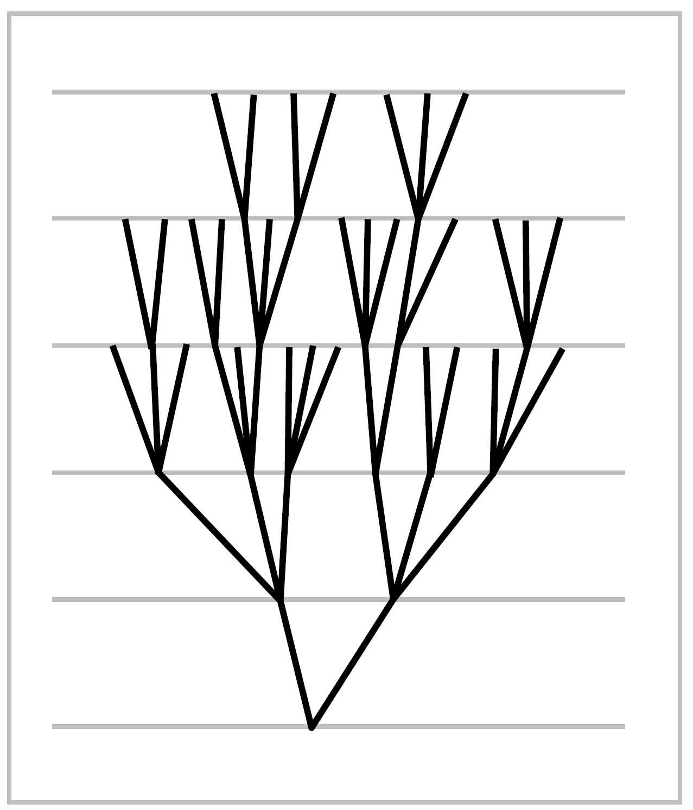

.. _Section 1.A:
1.A. Graphs and Free Groups
================================================

|indent| Since all groups can be realized as fundamental groups of spaces, this opens the
way for using topology to study algebraic properties of groups. The topics in this
section and the next give some illustrations of this principle, mainly using covering
space theory.

|indent| We remind the reader that the Additional Topics which form the remainder of 
this chapter are not to be regarded as an essential part of the basic core of the book.
Readers who are eager to move on to new topics should feel free to skip ahead.
|
|indent| By definition, a **graph** is a :math:`1`-dimensional CW complex, in other words, a space
:math:`X` obtained from a discrete set :Math:`X^0` by attaching a collection of :Math:`1`-cells :Math:`e_\alpha`. Thus :math:`X`
is obtained from the disjoint union of :math:`X^0` with closed intervals :math:`I_\alpha` by identifying the
two endpoints of each :math:`I_\alpha` with points of :Math:`X^0`. The points of :math:`X^0` are the **vertices** and 
the :math:`1`-cells the **edges** of :math:`X`. Note that with this definition an edge does not include its
endpoints, so an edge is an open subset of :Math:`X`. The two endpoints of an edge can be 
the same vertex, so the closure :Math:`\bar{e}_\alpha` of an edge :Math:`e_\alpha` in an open (or closed)
set in :math:`\bar{e}_\alpha`. One says that :math:`X` has the **weak topology** with respect to the subspaces :math:`\bar{e}_\alpha`.
In this topology a sequence of points in the interiors of distinct edges forms a closed
subset, hence never converges. This is true in particular if the edges containing the
sequence all have a common vertex and one tries to choose the sequence so that it
gets 'closer and closer' to the vertex. Thus if there is a vertex that is the endpoint
of infinitely many edges, then the weak topology cannot be a metric topology. An
exercise at the end of this section is to show the coverse, that the weak topology is
a metric topology if each vertex is an endpoint of only finitely many edges.

|indent| A basis for the topology of :math:`X` consists of the open intervals in the edges together
with the path-connected neighborhoods of the vertices. A neighborhood of the latter
sort about a vertex :math:`v` is the union of connected open neighborhoods :math:`U_\alpha` of :math:`v` in :math:`\bar{e}_\alpha`
for all :math:`\bar{e}_\alpha` containing :math:`v`. In particular, we see that :math:`X` is locally path-connected. Hence
a graph is connected iff it is path-connected.

|indent| If :Math:`X` has only finitely many vertices and edges, then :math:`X` is compact, being the
continuous image of the compact space :math:`X^0\coprod _\alpha I_\alpha`. The converse is also true, and more 
generally, a compact subset :math:`C` of a graph :math:`X` can meet only finitely many verticces and 
edges of :math:`X`. To see this, let the subspace :math:`D \subset C` consist of the vertices in :math:`C` together
with one point in each edge that :math:`C` meets. Then :math:`D` is closed subset of :math:`X` since it
meets each :math:`\bar{e}_\alpha` in a closed set. For the same reason, any subset of :math:`D` is closed, so :math:`D`
has the discrete topology. But :math:`D` is compact, being a closed subset of the compact 
space :math:`C`, so :math:`D` must be finite. By the definition of :math:`D` this means that :math:`C` can meet only
finitely many vertices and edges.

|indent| A **subgraph** of a graph :math:`X` is a subspace :math:`Y \subsetX` that is a union of vertices and 
edges of :math:`X`, such that :math:`e_\alpha \subset Y` implies :math:`\bar{e}_\alpha \subset Y`. The latter condition just says that
:math:`Y` is a closed subspace of :math:`X`. A tree is a contractible graph. By a tree in a graph :math:`X`
we mean a subgraph that is a tree. We call a tree in :math:`X` **maximal** if it contains all the 
vertices of :math:`X`. This is equivalent to the more obvious meaning of maximality, as we will see below.

.. _Proposition 1A.1:

.. container::

        **Proposition 1A.1.** *Every connected graph contains a maximal tree, and in fact any
        tree in the graph is contained in a maximal tree.*

    **Proof:** Let :math:`X` be a connected graph. We will describe a construction that embeds
    an arbitrary subgraph :math:`X_0 \subset X` as a deformation retract of a subgraph :math:`Y \subset X` that
    contains all the vertices of :math:`X`. By choosing :Math:`X_0` to be any subtree of :math:`X`, for example a 
    single vertex, this will prove the proposition.

    |indent| As a preliminary step, we construct a sequence of subgraphs :math:`X_0 \subset X_1 \subset X_2 \subset \cdots`,
    letting :math:`X_{i+1}` be obtained from :math:`X_i` by adjoining the closures :math:`\bar{e}_\alpha` of all edges :math:`e_\alpha \subset X-X_i`
    having at least one endpoint in :math:`X_i`. Furthermore, :math:`\bigcup _i X_i` is closed since it is a union
    of closed edges and :math:`X` has the weak topology. So :math:`X=\bigcup _iX_i` since :math:`X` is connected.

    |indent| Now to construct :math:`Y` we begin by setting :Math:`Y_0=X_0`. Then inductively, assuming
    that :math:`Y_i \subset X_i` has been constructed so as to contain all the vertices of :math:`X_i`, let :math:`Y_{i+1}` be
    obtained from :math:`Y_i` by adjoining one edge connecting each vertex of :math:`X_{i+1}-X_i` to :math:`Y_i`, and
    let :math:`Y=\bigcup _i Y_i`. It is evident that :math:`Y_{i+1}` deformation retracts to :Math:`Y_i`, and we may obtain
    a deformation retraction of :Math:`Y` to :math:`Y_0=X_0` by performing the deformation retraction
    of :Math:`Y_{i+1}` to :math:`Y_i` during the time interval :math:`[1/2^{i+1}, 1/2^i]`. Thus a point :math:`x \in Y_{i+1}-Y_i` is
    stationary untill this interval, when it moves into :math:`Y_i` and thereafter continues moving
    until it reaches :math:`Y_0`. The resulting homotopy :math:`h_t: Y \rightarrow Y` is continuous since it is
    continuous on the closure of each edge and :math:`Y` has the weak topology. |qed|

|indent| Given a maximal tree :math:`T \subset X` and a base vertex :math:`x_0 \in T`, then each edge :math:`e_\alpha` of
:math:`X-T` determines a loop :math:`f_\alpha` in :math:`X` that goes first from :math:`x_0` to one endpoint of :math:`e_\alpha` by
a path in :math:`T`, then across :math:`e_\alpha`, then back to :math:`x_0` by a path in :math:`T`. Strictly speaking, we 
should first orient the edge :math:`e_\alpha` in order to specify which direction to cross it. Note 
that the homotopy class of :Math:`f_\alpha` is independent of the choice of the paths in :math:`T` since :Math:`T`
is simply-connected.

.. _Proposition 1A.2:

.. container::

        **Proposition 1A.2.** *For a connected graph* :math:`X` *with maximal tree* :math:`T,\, \pi_1(X)` *is a free
        group with basis the classes* :math:`[f_\alpha]` *corresponding to the edges* :math:`e_\alpha` *of* :math:`X-T`.
    
    |indent| In particular this implies that a maximal tree is maximal in the sense of not being
    contained in any larger tree, since adjoining any edge to a maximal tree produces a 
    graph with nontrivial fundamental group. Another consequence is that a graph is a 
    tree iff it is simply-connected.

    **Proof:** The quotient map :math:`X \rightarrow X/T` is a homotopy equivalence by :ref:`Proposition 0.17 <Proposition 0.17>`.
    The quotient :math:`X/T` is a graph with only one vertex, hence is a wedge sum of circles,
    whose fundamental group we showed in :ref:`Example 1.21 <Example 1.21>` to be free with basis the loops
    given by the edges of :Math:`X/T`, which are the images of the loops :math:`f_\alpha` in :math:`X`. |qed|

|indent| Here is a very useful fact about graphs:

.. _Lemma 1A.3:

.. container::

        **Lemma 1A.3.** *Every covering space of a graph is also a graph, with vertices and
        edges the lifts of the vertices and edges in the base graph.*
    
    **Proof:** Let :math:`p:\tilde{X} \rightarrow X` be the covering space. For the vertices of :math:`\tilde{X}` we take the discrete
    set :math:`\tilde{X}^0=p^{-1}(X^0)`. Writing :math:`X` as a quotient space of :math:`X^0 \coprod _\alpha I_\alpha` as in the definition
    of a graph and applying the path lifting property to the resulting maps :math:`I_\alpha \rightarrow X`, we 
    get a unique lift :math:`I_\alpha \rightarrow \tilde{X}` passing through each point in :math:`p^{-1}(x)`, for :math:`x \in e_\alpha`. These
    lifts define the edges of a graph structure on :Math:`\tilde{X}`. The resulting topology on :Math:`\tilde{X}` is the 
    same as its original topology since both topologies have the same basic open sets, the
    covering projection :math:`\tilde{X} \rightarrow X` being a local homeomorphism. |qed|

|indent| We can now apply what we have proved about graphs and their fundamental
groups to prove a basic fact of group theory:

.. _Theorem 1A.4:

.. container::

        **Theorem 1A.4.** *Every subgroup of a free group is free.*

    **Proof:** Given a free group :math:`F`, choose a graph :math:`X` with :Math:`\pi_1(X) \approx F`, for example a wedge
    of circles corresponding to a basis for :Math:`F`. For each subgroup :math:`G` of :math:`F` there is by
    :ref:`Proposition 1.36 <Proposition 1.36>` a covering space :math:`p:\tilde{X} \rightarrow X` with :math:`p_*(\pi_1(\tilde{X}))=G`, hence :math:`\pi_1(\tilde{X})\approx G`
    since :Math:`p_*` is injective by :ref:`Proposition 1.31 <Proposition 1.31>`. Since :Math:`\tilde{X}` is a graph by the preceding lemma,
    the group :math:`G\approx \pi_1(\tilde{X})` is free by :ref:`Proposition 1A.2 <Proposition 1A.2>`. |qed|

|indent| The structure of trees can be elucidated by looking more closely at the constructions
in the proof of :ref:`Proposition 1A.1 <Proposition 1A.1>`. If :math:`X` is a tree and :math;`v_0` is any vertex of :math:`X`, then the
construction of a maximal tree :math:`Y \subset X` starting with :math:`Y_0 = \{v_0\}`
yields an increasing sequence of subtrees :math:`Y_n \subset X` whose union is 
all of :math:`X` since a tree has only one maximal subtree, namely itself.
We can think of the vertices in :math:`Y_n - Y_{n-1}` as being at 'height' :math:`n`,
with the edges of :math:`Y_n - Y_{n-1}` connecting these vertices to vertices
of height :math:`n-1`. In this way we get a 'height function' :math:`h:X \rightarrow \mathbb{R}`
assigning to each vertex its height, and monotone on edges.

|indent| For each vertex :math:`v` of :math:`X` there is exactly one edge leading downward from :math:`v`, so
by following these downward edges we obtain a path :math:`v` to the base vertex :math:`v_0`.
This is an example of an **edgepath**, which is a composition of finitely many paths each
consisting of a single edge traversed monotonically. For any edgepath joining :math:`v` to :math:`v_0`
other than the downward edgepath, the height function would not be monotone and
hence would have local maxima, occurring when the edgepath backtracked, retracing
some edge it had just corssed. Thus in a tree there is a unique nonbacktracking
edgepath joining any two points. All the vertices and edges along this edgepath are
distinct.

|indent| A tree can contain no subgraph homeomorphic to a circle, since two vertices 
in such a subgraph could be joined by more than one nonbacktracking edgepath.
Conversely, if a connected graph :math:`X` contains no circle subgraph, then it must be a 
tree. For if :Math:`T` is a maximal tree in :math:`X` that is not equal to :math:`X`, then the union of an edge
of :Math:`X-T` with the nonbacktracking edgepath in :math:`T` joining the endpoints of this edge is 
a circle subgraph of :Math:`X`. So if there are no circle subgraphs of :Math:`X`, we must have :Math:`X=T`,
a tree.

|indent| For an arbitrary connected graph :math:`X` and a pair of vertices :math:`v_0` and :math:`v_1` in :math:`X` there is 
a unique nonbacktracking edgepath in each homotopy class of paths from :math:`v_0` to :math:`v_1`.
This can be seen by lifting to the universal cover :math:`\tilde{X}`, which is a tree since it is simply-connected.
Choosing a lift :math:`\tilde{v_0}` of :math:`v_0`, a homotopy class of paths from :math:`v_0` to :math:`v_1` lifts to
a homotopy class of paths starting at :math:`\tilde{v}_0` and ending at a unique lift :math:`\tilde{v}_1` of :math:`v_1`. Then
the unique nonbacktracking edgepath in :math:`\tilde{X}` from :math:`\tilde{v}_0` to :math:`\tilde{v}_1` projects to the desired
nonbacktracking edgepath in :math:`X`.

------------
Exercises
------------

.. _Exercise 1-1A-1:

**1.** Let :math:`X` be a graph in which each vertex is an endpoint of only finitely many edges.
Show that the weak topology on :math:`X` is a metric topology.

.. _Exercise 1-1A-2:

**2.** Show that a connected graph retracts onto any connected subgraph.

.. _Exercise 1-1A-3:

**3.** For a finite graph :math:`X` define the Euler characteristic :math:`\chi (X)` to be the number of
vertices minus the number of edges. Show that :math:`\chi (X) =1 ` if :math:`X` is a tree, and that the
rank (number of elements in a basis) of :math:`\pi_1(X)` is :math:`1-\chi (X)` if :math:`X` is connected.

.. _Exercise 1-1A-4:

**4.** If :math:`X` is a finite graph and :math:`Y` is a subgraph homemomorphic to :math:`S^1` and containing the
basepoint :Math:`x_0`, show that :Math:`\pi_1(X,x_0)` has a basis in which one element is represented
by the loop :math:`Y`.

.. _Exercise 1-1A-5:

**5.** Construct a connected graph :math:`X` and maps :math:`f,g: X \rightarrow X` such that :math:`fg=\mathbb{1}` but :math:`f`
and :math:`g` do not induce isomorphisms on :math:`\pi_1`. [Note that :math:`f_* g_*=\mathbb{1}` implies that :math:`f_*` is 
surjective and :Math:`g_*` is injective.]

.. _Exercise 1-1A-6:

**6.** Let :math:`F` be the free group on two generators and let :math:`F'` be its commutator subgroup.
Find a set of free generators for :math:`F'` by considering the covering space of the graph
:math:`S^1 \vee S^1` corresponding to :math:`F'`.

.. _Exercise 1-1A-7:
**7.** If :math:`F` is a finitely generated free group and :math:`N` is a nontrivial normal subgroup of
infinite index, show, using covering spaces, that :math:`N` is not finitely generated.

.. _Exercise 1-1A-8:
**8.** Show that a finitely generated group has only a finite number of subgroups of a 
given finite index. [First do the case of free groups, using covering spaces of graphs.
The general case then follows since every group is a quotient group of a free group.]

.. _Exercise 1-1A-9:
**9.** Using covering spaces, show that an index :math:`n` subgroup :math:`H` of a group :math:`G` has at most
:math:`n` conjugate subgroups :Math:`gHg^{-1}` in :math:`G`. Apply this to show that there exists a normal
subgroup :math:`K \subset G` of finite index with :math:`K \subset H`. [For the latter statement, consider
the intersection of all the conjugate subgroups :math:`gHg^{-1}`. This is the maximal normal
subgroup of :math:`G` contained in :math:`H`.]

.. _Exercise 1-1A-10:
**10.** Let :math:`X` be the wedge sum of :math:`n` circles, with its natural graph structure, and let
:math:`\tilde{X} \rightarrow X` be a covering space with :math:`Y \subset \tilde{X}` a finite connected subgraph. Show there is
a finite graph :math:`Z \supset Y` having the same vertices as :math:`Y`, such that the projection :math:`Y \rightarrow X`
extends to a covering space :math:`Z \rightarrow X`.

.. _Exercise 1-1A-11:
**11.** Apply the two preceding prolbems to show that if :Math:`F` is a finitely generated free
group and :math:`x \in F` is not the identity element, then there is a normal subgroup :math:`H \subset F`
of finite index such that :math:`x \in H`. Hence :math:`x` has a nontrivial image in a finite quotient
group of :math:`F`. In this situation one says :math:`F` is **residually finite**.

.. _Exercise 1-1A-12:
**12.** Let :math:`F` be a finitely generated free group, :math:`H \subset F` a finitely generated subgroup, and
:math:`x \in F - H`. Show there is a subgroup :math:`K` of finite index in :math:`F` such that :math:`K \supset H` and
:math:`x \notin K`. [Apply Exercise 10.]

.. _Exercise 1-1A-13:
**13.** Let :math:`x` be a nontrivial element of a finitely generated free group :math:`F`. Show there is
a finite-index subgroup :math:`H \subset F` in which :math:`x` is one element of a basis. [Exercises 4 and 
10 may be helpful.]

.. _Exercise 1-1A-14:
**14.** Show that the existence of maximal trees is equivalent to the Axiom of Choice.

.. |indent| raw:: html

    

.. |qed| raw:: html
    
    &#9723