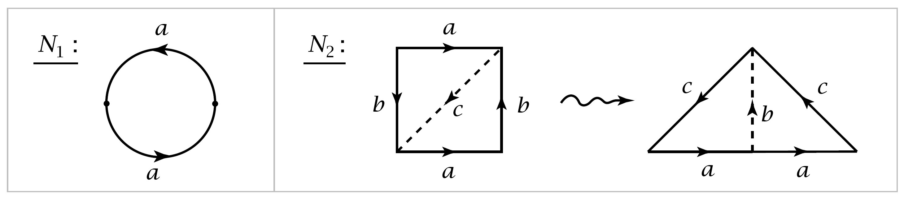
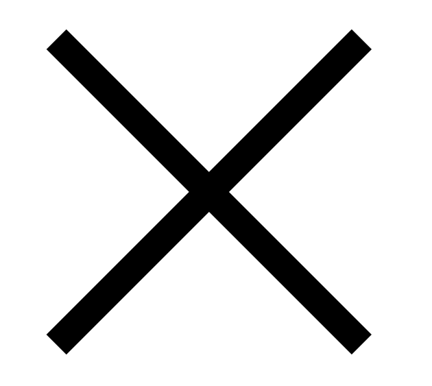
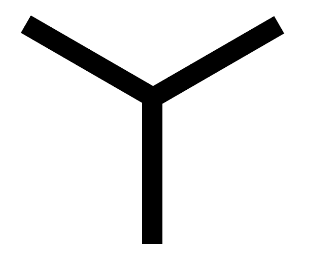

Applications to Cell Complexes
================================================

|indent| For the remainder of this section we shall be interested in cell complexes, and in
particular in how the fundamental group is affected by attaching :math:`2`-cells.

|indent| Suppose we attach a collection of :math:`2`-cells :math:`e^2_\alpha` to a path-connected space :math:`X` via maps
:math:`\varphi_\alpha : S^1 \rightarrow X`, producing a space :math:`Y`. If :math:`s_0` is a basepoint of :math:`S^1` then :math:`\varphi_\alpha` determines a loop
at :math:`\varphi_\alpha(s_0)` that we shall call :math:`\varphi_\alpha`, even though technically loops are maps :math:`I \rightarrow X` rather
than :math:`S^1 \rightarrow X`. For different :math:`\alpha`'s the basepoints :math:`\varphi_\alpha(s_0)` of these loops :math:`\varphi_\alpha` may not all
coincide. To remedy this, choose a basepoint :math:`x_0 \in X` and a path :math:`\gamma_\alpha` in :math:`X` from :math:`x_0` to
:math:`\varphi_\alpha(s_0)` for each :math:`\alpha`. Then :math:`\gamma_\alpha \varphi_\alpha \bar{\gamma}_\alpha` is a loop at :math:`x_0`. This loop may not be nullhomotopic
in :math:`X`, but it will certainly be nullhomotopic after the cell :math:`e^2_\alpha` is attached. Thus the 
normal subgroup :math:`N \subset \pi_1(X,x_0)` generated by all the loops :math:`\gamma_\alpha \varphi_\alpha \bar{\gamma}_\alpha` for varying :math:`\alpha`
lies in the kernel of the map :math:`\pi_1(X,x_0)\rightarrow \pi_1(Y,x_0)` induced by the inclusion :math:`X \hookrightarrow Y`.

.. _Proposition 1.26:

.. container::

        **Proposition 1.26.** (a) *If* :math:`Y` *is obtained from* :math:`X` *by attaching* :math:`2`-*cells as described
        above, then the inclusion* :math:`X \hookrightarrow Y` *induces a surjection* :math:`\pi_1(X,x_0)\rightarrow \pi_1(Y,x_0)` *whose
        kernel is* :math:`N`. *Thus* :math:`\pi_1(Y) \approx \pi_1(X)/N` .
        (b) *If* :math:`Y` *is obtained from* :math:`X` *by attaching* :math:`n`-*cells for a fixed* :math:`n>2`, *then the inclusion*
        :math:`X \hookrightarrow Y` *induces an isomorphism* :math:`\pi_1(X,x_0) \approx \pi_1(Y, x_0)`.
        (c) *For a path-connected cell complex* :math:`X` *the inclusion of the* :math:`2`-*skeleton* :math:`X^2 \hookrightarrow X` *induces
        an isomorphism* :math:`\pi_1(X^2, x_0) \approx \pi_1(X,x_0)`.
    
    |indent| It follows from (a) that :math:`N` is independent of the choice of the paths :math:`\gamma_\alpha`, but
    this can also be seen directly: If we replace :math:`\gamma_\alpha` by another path :math:`\eta_\alpha` having the same
    endpoints, then :math:`\gamma_\alpha \varphi_\alpha \bar{\gamma}_\alpha` changes to :math:`\eta_\alpha \varphi_\alpha \bar{\eta}_\alpha=(\eta_\alpha \bar{\gamma}_\alpha)\gamma_\alpha \varphi_\alpha \bar{\gamma}_\alpha (\gamma_\alpha \bar{\eta}_\alpha)`, so :math:`\gamma_\alpha \varphi_\alpha \bar{\gamma}_\alpha`
    and :math:`\eta_\alpha \varphi_\alpha \bar{\eta}_\alpha` define conjugate elements of :math:`\pi_1(X,x_0)`.

    **Proof:** (a) Let us expand :math:`Y` to a slightly larger space :math:`Z` that deformation retracts 
    onto :math:`Y` and is more convenient for applying van Kampen's theorem. 
    
    .. image:: fig/prop-1-26.png
        :align: right
        :width: 50%
    
    The space :math:`Z`
    is obtained from :math:`Y` by attaching rectangular strips :math:`S_\alpha = I \times I`, with the lower edge
    :math:`I \times \{0\}` attached along :math:`\gamma_\alpha`, the right edge
    :math:`\{1\} \times I` attached along an arc that starts
    at :math:`\varphi_\alpha(s_0)` and goes radially into :math:`e^2_\alpha`, and 
    all the left edges :math:`\{0\} \times I` of the different
    strips identified together. The top
    edges of the strips are not attached to 
    anything, and this allows us to deformation retract :math:`Z` onto :math:`Y`.

    |indent| In each cell :math:`e^2_\alpha` choose a point :math:`y_\alpha` not in the arc along which :math:`S_\alpha` is attached, Let
    :math:`A=Z-\bigcup _\alpha \{y_\alpha\}` and let :math:`B=Z-X`. Then :math:`A` deformation retracts onto :math:`X`, and :math:`B` is 
    contractible. Since :math:`\pi_1(b)=0`, van Kampen's theorem applied to the cover :math:`\{A,B\}` says
    that :math:`\pi_1(Z)` is isomorphic to the quotient of :math:`\pi_1(A)` by the normal subgroup genertated
    by the image of the map :math:`\pi_1(A \cap B) \rightarrow \pi_1(A)`. More specifically, choose a basepoint
    :math:`z_0 \in A \cap B` near :math:`x_0` on the segment where all the strips :math:`S_\alpha` intersect, and choose
    loops :math:`\delta_\alpha` in :math:`A\cap B` based at :math:`z_0` representing the elements of :Math:`\pi_1(A,z_0)` corresponding
    to :math:`[\gamma_\alpha \varphi_\alpha \bar{\gamma_\alpha}] \in \pi_1(A,x_0)` under the basepoint-change isomorphism :math:`\beta_h` for :math:`h` the line
    segment connecting :math:`z_0` to :math:`x_0` in the intersection of the :math:`S_\alpha`'s. To finish the proof of 
    part (a) we just need to check that :math:`\pi_1(A \cap B, z_0)` is generated by the loops :math:`\delta_\alpha`. This
    can be done by another application of van Kampen's theorem, this time to the cover 
    of :math:`A \cap B` by the open sets :math:`A_\alpha = A \cap B - \bigcup _{\beta \neq \alpha} e^2_\beta`. Since :math:`A_\alpha` deformation retracts onto
    a circle in :math:`e^2_\alpha - \{y_\alpha\}`, we have :math:`\pi_1(A_\alpha, z_0) \approx \mathbb{Z}` generated by :math:`\delta_\alpha`.

    |indent| The proof of (b) follows the same plan with cells :math:`e^n_\alpha` instead of :math:`e^2_\alpha`. The only
    difference is that :math:`A_\alpha` deformation retracts onto a sphere :math:`S^{n-1}` so :math:`\pi_1(A_\alpha)=0` if :math:`n>2`
    by :ref:`Proposition 1.14 <Proposition 1.14>`. Hence :math:`\pi_1(A \cap B) = 0` and the result follows.

    |indent| Part (c) follows from (b) by induction when :math:`X` is finite-dimensional, so :math:`X=X^n`
    for some :Math:`n`. When :math:`X` is not finite-dimensional we argue as follows. Let :math:`f:I \rightarrow X` be 
    a loop at the basepoint :Math:`x_0 \in X^2`. This has compact image, which must lie in :math:`X^n` for 
    some :math:`n` by :ref:`Proposition A.1 <Proposition A.1>` in the :ref:`Appendix <Appendix>`. Part (b) then implies that :math:`f` is homotopic
    to a loop in :math:`X^2`. Thus :math:`\pi_1(X^2, x_0) \rightarrow \pi_1(X, x_0)` is surjective. To see that it is also
    injective, suppose that :math:`f` is a loop in :math:`X^2` which is nullhomotopic in :math:`X` via a homotopy
    :math:`F:I \times I \rightarrow X`. This has compact image lying in some :Math:`X^n`, and we can assume :math:`n >2`.
    Since :math:`\pi_1(X^2, x_0) \rightarrow \pi_1(X^n , x_0)` is injective by (b), we conclude that :math:`f` is nullhomotopic
    in :math:`X^2`. |qed|

|indent| As a first application we compute the fundamental group of the orientable surface 
:math:`M_g` of genus :math:`g`. This has a cell structure with one :math:`0`-cell, :math:`2g \quad 1`-cells, and one :math:`2`-cell, as
we saw in :ref:`Chapter 0 <Chapter 0>`. The :math:`1`-skeleton is a wedge sum of :math:`2g` circles, with fundamental
group free on :math:`2g` generators. The :math:`2`-cell is attached along the loop given by the 
product of the commutators of these generators, say :math:`[a_1,b_1] \cdots [a_g,b_g]`. Therefore

.. math::

    \pi_1(M_g) \approx \langle a_1,b_1, \cdots a_g,b_g | [a_1,b_1] \cdots [a_g, b_g] \rangle

where :math:`\langle g_\alpha | r_\beta \rangle` denotes the group with generators :math:`g_\alpha` and relators :math:`r_\beta`, in other
words, the free group on the generators :math:`g_\alpha` modulo the normal subgroup generated 
by the words :math:`r_\beta` in these generators.

.. _Corollary 1.27:

.. container::

        **Corollary 1.27.** *The surface* :math:`M_g` *is not homeomorphic, or even homotopy equivalent,
        to* :math:`M_h` *if* :math:`g \neq h`.
    
    **Proof:** The abelianization of :math:`\pi_1(M_g)` is the direct sum of :math:`2g` copies of :math:`\mathbb{Z}`. So if
    :math:`M_g \simeq M_h` then :math:`\pi_1(M_g) \approx \pi_1(M_h)`, hence the abelianizations of these groups are 
    isomorphic, which implies :math:`g=h`. |qed|

|indent| Nonorientable surfaces can be treated in the same way. If we attach a :math:`2`-cell to the 
wedge sum of :math:`g` circles by the word :math:`a^2_1 \cdots a^2_g` we obtain a nonorientable surface :math:`N_g`.
For example, :math:`N_1` is the projective plane :math:`\mathbb{R}P^2`, the quotient of :math:`D^2` with antipodal points
of :math:`\partial D^2` identified, and :math:`N_2` is the Klein bottle, though the more usual representation
of the Klein bottle is as a square with opposite sides identified via the word :math:`aba^{-1}b`.

If one cuts the square along a diagonal and reassembles the resulting two triangles
as shown in the figure, one obtains the other representation as a square with sides 
identified via the word :math:`a^2c^2`. By the :ref:`proposition <Proposition 1.26>`, :math:`\pi_1(N_g) \approx \langle a_1, \cdots , a_g | a^2_1 \cdots a^2_g \rangle`.
This abelianizes to the direct sum of :math:`\mathbb{Z}_2` with :math:`g-1` copies of :math:`\mathbb{Z}` since in the abelianization
we can rechoose the generators to be :math:`a_1, \cdots , a_{g-1}` and :math:`a_1 + \cdots + a_g`, with
:math:`2(a_1 + \cdots + a_g) =  0`. Hence :math:`N_g` is not homotopy equivalent to :math:`N_h` if :math:`g \neq h`, nor is
:math:`N_g` homotopy equivalent to any orientable surface :math:`M_h`.

|indent| Here is another application of the preceding proposition:

.. _Corollary 1.28:

.. container::

        **Corollary 1.28.** *For every group* :math:`G` *there is a* :math:`2`-*dimensional cell complex* :matH:`X_G` *with*
        :math:`\pi_1(X_G) \approx G`.
    
    **Proof:** Choose a presentation :math:`G= \langle g_\alpha | r_\beta \rangle`. This exists since every group is a 
    quotient of a free group, so the :math:`g_\alpha`'s can be taken to be the generators of this free
    group with the :math:`r_\beta`'s generators of the kernel of the map from the free group to :math:`G`.
    Now construct :math:`X_G` from :matH:`\bigvee _\alpha S^1_\alpha` by attaching :math:`2`-cells :math:`e^2_\beta` by the loops specified by the
    words :math:`r_\beta`. |qed|

.. _Example 1.29:

.. container::

    **Example 1.29.** If :math:`G=\langle a | a^n \rangle = \mathbb{Z}_n` then :math:`X_G` is :math:`S^1` with a cell :math:`e^2` attached by the map
    :math:`z \mapsto z^n`, thinking of :Math:`S^1` as the unit circle in :math:`\mathbb{C}`. When :math:`n=2` we get :math:`X_G=\mathbb{R}P^2`, but for
    :math:`n>2` the space :math:`X_G` is not a surface since there are :math:`n` 'sheets' of :math:`e^2` attached at each
    point of the circle :math:`S^1 \subset X_G`. 
    
    .. image:: fig/eg-1-29.png
        :align: right
        :width: 40%
    
    For example, when :math:`n=3` one can construct a neighborhood 
    :math:`N` of :Math:`S^1` in :math:`X_G` by taking the product of the 
    graph |Y| with the interval :math:`I`, and then identifying
    the two ends of this product via a one-third twist as 
    shown in the figure. The boundary of :math:`N` consists
    of a single circle, formed by the three endpoints of
    each |Y| cross section of :math:`N`. To complete the construction of :math:`X_G` from :math:`N` one attaches
    a disk along the boundary circle of :math:`N`. This cannot be done in :math:`\mathbb{R}^3`, though it can in
    :math:`\mathbb{R}^4`. For :math:`n=4` one would use the graph |X| instead of |Y|, with one-quarter twist
    instead of one-third twist. For larger :math:`n` one would use an :math:`n`-pointed 'asterisk' and 
    a :math:`\frac{1}{n}` twist.

.. |indent| raw:: html

    

.. |qed| raw:: html
    
    &#9723

    
