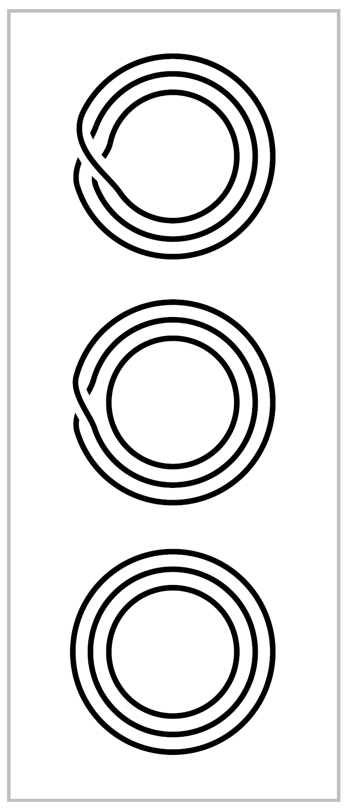

The Classification of Covering Spaces
================================================

|indent| We consider next the problem of classifying all the different covering spaces of 
afixed space :math:`X`. Since the whole chapter is about paths, it should not be surprising
that we will restrict attention to spaces :math:`X` that are at least locally path-connected.
Path-components of :math:`X` are then the same as components, and for the purpose of classifying 
the covering spaces of :math:`X` there is no loss in assuming that :math:`X` is connected,
or equivalently, path-connected. Local path-connectedness is inherited by covering
spaces, so connected covering spaces of :math:`X` are the same as path-connected covering
spaces. The main thrust of the classification will be a correspondence between connected
covering spaces of :math:`X` and subgroups of :math:`\pi_1(X)`. This is often called the Galois
correspondence because of its surprising similarity to another basic correspondence
in the purely algebraic subject of Galois theory. We will also describe a different
method of classification that includes disconnected covering spaces as well.

|indent| The Galois correspondence arises from the function that assigns to each covering
space :math:`p:(\tilde{X}, \tilde{x}_0)` the subgroup :math:`p_*(\pi_1(\tilde{X}, \tilde{x}_0))` of :math:`\pi_1(X,x_0)`. First we 
consider whether this function is surjective. That is, we ask whether every subgroup of 
:math:`\pi_1(X,x_0)` is realized as :math:`p_*(\pi_1(\tilde{X},\tilde{x}_0))` for some covering space :math:`p:(\tilde{X},\tilde{x}_0) \rightarrow (X, x_0)`.
In particular we can ask whether the trivial subgroup is realized. Since :math:`p_*` is always 
injective, this amounts to asking whether :math:`X` has a simply-connected covering space.
Answering this will take some work.

|indent| A necessary condition for :math:`X` to have a simply-connected covering space is the
following: Each point :Math:`x \in X` has a neighborhood :math:`U` such that the inclusion-induced 
map :math:`\pi_1(U,x) \rightarrow \pi_1(X,x)` is trivial; one says :math:`X` is **semilocally simply-connected** if 
this holds. To see the necessity of this condition, suppose :math:`p:\tilde{X} \rightarrow X` is a covering
space with :math:`\tilde{X}` simply-connected. Every point :math:` \in X` has a neighborhood :math:`U` having a 
lift :math:`\tilde{U} \subset \tilde{X}` projecting homeomorphically to :math:`U` by :math:`p`. Each loop in :math:`U` lifts to a loop
in :math:`\tilde{U}`, and the lifted loop is nullhomotopic in :Math:`\tilde{X}` since :math:`\pi_1(\tilde{X})=0`. So, composing this
nullhomotopy with :math:`p`, the original loop in :math:`U` is nullhomotopic in :math:`X`.

|indent| A locally simply-connected space is certainly semilocally simply-connected. For
example, CW complexes have the much stronger property of being locally contractible,
as we show in the :ref:`Appendix <Appendix>`. An example of a space that is not semilocally simply-connected
is the shrinking wedge of circles, the subspace :math:`X \subset \mathbb{R}^2` consisting of the
circles of radius :math:`\frac{1}{n}` centered at the point :math:`(\frac{1}{n},0)` for :math:`n=1,2, \cdots`, introduced in
:ref:`Example 1.25 <Example 1.25>`. On the other hand, if we take the cone :math:`CX=(X \times I ) / (X \times \{0\})` on the 
shrinking wedge of circles, this is semilocally simply-connected since it is contractible, but
it is not locally simply-connected.

|indent| We shall now show how to construct a simply-connected covering space of :math:`X` if
:math:`X` is paht-connected, locally path-connected, and semilocally simply-connected. To
motivate the construction, suppose :math:`p:(\tilde{X}, \tilde{x}_0) \rightarrow (X,x_0)` is a simply-connected covering 
space. Each point :math:`\tilde{x} \in \tilde{X}` can then be joined to :math:`\tilde{x}_0` by a unique homotopy class of
paths, by :ref:`Proposition 1.6 <Proposition 1.6>`, so we can view poitns of :Math:`\tilde{X}` as homotopy classes of paths
starting at :math:`\tilde{x}_0`. The advantage of this is that, by the homotopy lifting property, homotopy
classes of paths in :math:`\tilde{X}` starting at :math:`\tilde{x}_0` are the same as homotopy classes of paths
in :math:`X` starting at :math:`\tilde{x}_0`. This gives a way of describing :math:`\tilde{X}` purely in terms of :Math:`X`.

|indent| Given a path-connected, locally path-connected, semilocally simply-connected
space :math:`X` with a basepoint :math:`x_0 \in X`, we are therefore led to define

.. math::

    \tilde{X} = \{ [\gamma] \mid \gamma \text{ is a path in } X \text{ starting at } x_0\}

where, as usual, :matH:`[\gamma]` denotes the homotopy class of :math:`\gamma` with respect to homotopies
that fix the endpoints :math:`\gamma(0)` and :math:`\gamma(1)`. The function :math:`p:\tilde{X} \rightarrow X` sending :math:`[\gamma]` to :math:`\gamma (1)` is
then well-defined. Since :Math:`X` is path-connected, the endpoint :math:`\gamma(1)` can be nay point of 
:math:`X`, so :math:`p` is surjective.

|indent| Before we define a topology on :math:`\tilde{X}` we make a few preliminary observations. Let
:math:`\mathcal{U}` be hte collection of path-connected open sets :math:`U \subset X` such that :math:`\pi_1(U) \rightarrow \pi_1(X)` is
trivial. Note that if the map :math:`\pi_1(U) \rightarrow \pi_1(x)` is trivial for one choice of basepoint in :math:`U`,
it is trivial for all choices of basepoint since :math:`U` is path-connected. A path-connected
open subset :math:`V \subset U \in \mathcal{U}` is also in :math:`\mathcal{U}` since the composition :math:`\pi_1(V) \rightarrow \pi_1(U) \rightarrow \pi_1(X)`
will also be trivial. It follows that :math:`\mathcal{U}` is basis for the topology on :math:`X` if :math:`X` is locally
path-connected and semilocally simply-connected.

|indent| given a set :math:`U \in \mathcal{U}` and a path :math:`\gamma` in :math:`X` from :math:`x_0` to a point in :math:`U`, let

.. math::

    U_{[\gamma]}=\{[\gamma \cdot \eta] \mid \eta \text{ is a path in } U \text{ with } \eta(0)=\gamma(1) \}

As the notation indicates, :math:`U_{[\gamma]}` depends only on the homotopy class :math:`[\gamma]`. Observe
that :math:`p:U_{[\gamma]} \rightarrow U` is surjective since :math:`U` is path-connected and injective since different 
choices of :math:`\eta` joining :math:`\gamma(1)` to a fixed :math:`x \in U` are all homotopic in :math:`X`, the map
:math:`\pi_1(U) \rightarrow \pi_1(X)` being trivial. Another property is

(\*) :math:`U_{[\gamma]} = U_{[\gamma']}` if :math:`[\gamma'] \in U_{[\gamma]}`. For if :math:`\gamma'=\gamma \cdot \eta` then elements of :math:`U_{[\gamma']}` have the
    form :math:`[\gamma \cdot \eta \cdot \mu]` and hence lie in :math:`U_{[\gamma]}`, while elements of :math:`U_{[\gamma]}` have the form
    :math:`[\gamma \cdot \mu] = [\gamma \cdot \eta \cdot \bar{\eta} \cdot \mu] = [\gamma' \cdot \bar{\eta} \cdot \mu]` and hence lie in :math:`U_{[\gamma']}`.

This can be used to show that the sets :math:`U_{[\gamma]}` form a basis for a topology on :math:`\tilde{X}`. For if
we are given two such sets :math:`U_{[\gamma]},\, V_{[\gamma']}` and an element :math:`[\gamma''] \in U_{[\gamma]} \cap V_{[\gamma']}`, we have
:math:`U_{[\gamma]}=U_{[\gamma'']}` and :math:`V_{[\gamma']}=V_{[\gamma]''}` by (*). So if :math:`W \in \mathcal{U}` is contained in :math:`U \cap V` and contains
:math:`\gamma''(1)` then :math:`W_{[\gamma'']} \subset U_{[\gamma'']} \cap V_{[\gamma'']}` and :math:`[\gamma''] \in W_{[\gamma'']}`.

|indent| The bijection :math:`p:U_{[\gamma]} \rightarrow U` is a homeomorphism since it gives a bijection between
the subsets :math:`V_{[\gamma']} \subset U_{[\gamma]}` and the sets :math:`V \in \mathcal{U}` contained in :math:`U`. Namely, in one direction
we have :math:`p(V_{[\gamma']})=V` and in the other direction we have :math:`p^{-1}(V) \cap U_{[\gamma]} =V_{[\gamma']}` for
any :math:`[\gamma'] \in U_{[\gamma]}` with endpoint in :math:`V`, since :math:`V_{[\gamma']} \subset U_{[\gamma']}=U_{[\gamma]}` and :math:`V_{[\gamma']}` maps onto :math:`V`
by the bijection :math:`p`.

|indent| The preceding paragraph implies that :math:`p:\tilde{X} \rightarrow X` is continuous. We can also 
deduce that this is a covering space sincefor fixed :math:`U \in \mathcal{U}`, the sets :math:`U_{[\gamma]}` for varying :Math:`[\gamma]`
partition :math:`p^{-1}(U)` because if :math:`[\gamma''] \in U_{[\gamma]} \cap U_{[\gamma']}` then :math:`U_{[\gamma]}=U_{[\gamma'']}=U_{[\gamma']}` by (*).

|indent| It remains only to show that :math:`\tilde{X}` is simply-connected. For a point :math:`[\gamma] \in \tilde{X}` let :math:`\gamma_t`
be the path in :math:`X` that equals :math:`\gamma` on :math:`[0,t]` and is stationary at :Math:`\gamma(t)` on :math:`[t,1]`. Then the
function :math:`t\mapsto [\gamma_t]` is a path in :math:`\tilde{X}` lifting :math:`\gamma` that starts at :math:`[x_0]`, the homotopy class of
the constant path at :math:`x_0`, and ends at :math:`[\gamma]`. Since :math:`[\gamma]` was an arbitrary point in :Math:`\tilde{X}`, this
shows that :math:`\tilde{X}` is path-connected. To show that :math:`\pi_1(\tilde{X}, [x_0])=0` it suffices to show
that the image of this group udner :math:`p_*` are represented by loops :math:`\gamma` at :math:`x_0` that lift to loops in :math:`\tilde{X}` at :math:`[x_0]`. We have
observed that the path :math:`t \mapsto [\gamma_t]` lifts :math:`\gamma` starting at :math:`[x_0]`, and for this lifted path to
be a loop means that :math:`[\gamma_1]=[x_0]`. Since :math:`\gamma_1 = \gamma`, this says that :math:`[\gamma]=[x_0]`, so :math:`\gamma` is 
nullhomotopic and the image of :math:`p_*` is trivial.

|indent| This completes the construction of a simply-connected covering space :math:`\tilde{X} \rightarrow X`.
|
|indent| In concrete cases one usually constructs a simply-connected covering space by
more direct methods. For example, suppose :math:`X` is the union of subspaces :math:`A` and :math:`B` for
which simply-connected covering spaces :math:`\tilde{A} \rightarrow A` and :math:`\tilde{B} \rightarrow B` are already known. Then
one can attempt to build a simply-connected covering space :math:`\tilde{X} \rightarrow X` by assembling
copies of :math:`\tilde{A}` and :math:`\tilde{B}`. For example, for :math:`X=S^1 \vee S^1`, if we take :math:`A` and :math:`B` to be the two
circles, then :math:`\tilde{A}` and :math:`\tilde{B}` are each :math:`\mathbb{R}`, and we can build the simply-connected cover :math:`\tilde{X}`
described earlier in this section by glueing together infinitely many copies of :math:`\tilde{A}` and
:math:`\tilde{B}`, the horizontal and vertical lines in :math:`\tilde{X}`. Here is another illustration of this method:
|
.. _Example 1.35:

.. container::

    **Example 1.35.** For integers :math:`m,n \geq 2`, let :math:`X_{m,n}` be the quotient space of a cylinder
    :math:`S^1 \times I` under the identifications :math:`(z,0) ~ (e^{2 \pi i / m}z,0)` and :math:`(z,1) ~ (e^{2\pi i /n}z, 1)`. Let
    :math:`A \subset X` and :math:`B \subset X` be the quotients of :math:`S^1 \times [0, \frac{1}{2}]` and :math:`S^1 \times [\frac{1}{2},1]`, so :math:`A` and :math:`B` are 
    the mapping cylinders of :math:`z \mapsto z^m` and :math:`z \mapsto z^n`, with :math:`A \cap B=S^1`. The simplest case 
    is :math:`m=n=2`, when :math:`A` and :math:`B` are Möbius bands and :math:`X_{2,2}` is the Klein bottle. We
    encountered the complexes :math:`X_{m,n}` previously in alalyzing orus knot complements in 
    :ref:`Example 1.24 <Example 1.24>`.

    .. image:: fig/eg-1-29.png
        :align: right
        :width: 20%

    |indent| The figure for :ref:`Example 1.29 <Example 1.29>` at the end of preceding section
    shows what :math:`A` looks like in the typical case :math:`m=3`. We have :math:`\pi_1(A) \approx \mathbb{Z}`,
    and the universal cover :math:`\tilde{A}` is homeomorphic to a product :math:`C_m \times \mathbb{R}` where
    :math:`C_m` is the graph that is a cone on :math:`m` points, as shown in the figure to
    the right .The situation for :math:`B` is similar, and :math:`\tilde{B}` is hoemomorphic to 
    :math:`C_n \times \mathbb{R}`. Now we attempt to build the universal cover :math:`\tilde{X}_{m,n}` from copies
    of :math:`\tilde{A}` and :math:`\tilde{B}`. Start with a copy of :Math:`\tilde{A}`. Its boundary, the outer edges of 
    its fins, consists of :math:`m` copies of :math:`\mathbb{R}`. Along each of these :math:`m` boundary
    lines we attach a copy of :math:`\tilde{B}`. Each of these copies of :math:`\tilde{B}` has one of its boundary lines
    attached to the initial copy of :math:`\tilde{A}`, leaving :math:`n-1` boundary lines free, and we attach a 
    new copy of :math:`\tilde{A}` to each of these free boundary lines. Thus we now have :math:`m(n-1)+1`
    copies of :Math:`\tilde{A}`. Each of the newly attached copies of :math:`\tilde{A}` has :math:`m-1` free boundary lines,
    and to each of these lines we attach a new copy of :math:`\tilde{B}`. The process is now repeated ad 
    infinitum in the evident way. Let :math:`\tilde{X}_{m,n}` be the resulting space.

    .. image:: fig/eg-1-35-a.png
        :align: right
        :width: 30%
    
    |indent| The product structures :math:`\tilde{A} = C_m \times \mathbb{R}` and :Math:`\tilde{B}=C_n \times \mathbb{R}`
    gives :math:`\tilde{X}_{m,n}` the structure of a product :math:`T_{m,n} \times \mathbb{R}` where :math:`T_{m,n}`
    is an infinite graph constructed by an inductive scheme
    just like the construction of :math:`\tilde{X}_{m,n}`. Thus :math:`T_{m,n}` is the union
    of a sequence of finite subgraphs, each obtained from the 
    preceding by attaching new copies of :Math:`C_m` or :math:`C_n`. Each
    of these finite subgraphs deformation retracts onto the
    preceding one. The infinite concatenation of these deformation
    retractions, with the :math:`k^{th}` graph deformation retracting to the previous one
    during the time interval :math:`[\frac{1}{2^k}, \frac{1}{2^{k-1}}]`, gives a deformation retraction of :Math:`T_{m,n}` onto
    the initial stage :math:`C_m`. Since :math:`C_m` is contractible, this means :math:`T_{m,n}` is contractible, hence
    also :math:`\tilde{X}_{m,n}`, which is the product :math:`T_{m,n} \times \mathbb{R}`. In particular, :math:`\tilde{X}_{m,n}` is simply-connected.

    .. image:: fig/eg-1-35-b.png
        :align: right
        :width: 25%

    |indent| The map that projects each copy of :math:`\tilde{A}` in :math:`\tilde{X}_{m,n}` to :math:`A` and
    each copy of :math:`\tilde{B}` to :math:`B` is a covering space. To define this map
    precisely, choose a point :math:`x_0 \in S^1`, and then the image of the
    line segment :math:`\{x_0\} \times I` in :math:`X_{m,n}` meets :math:`A` in a line segment whose
    preimage in :math:`\tilde{A}` consists of an infinite number of line segments,
    appearing in the earlier figure as the horizontal segments spiraling 
    around the central vertical axis. The picture in :math:`\tilde{B}` is 
    similar, and when we glue together all the copies of :math:`\tilde{A}` and :math:`\tilde{B}`
    to form :math:`\tilde{X}_{m,n}`, we do so in such a way that these horizontal segments always line up
    exactly. This decomposes :math:`\tilde{X}_{m,n}` into infinitely many rectangles, each formed from a 
    rectangle in an :math:`\tilde{A}` and a rectangle in a :math:`\tilde{B}`. The covering projection :math:`\tilde{X}_{m,n} \rightarrow X_{m,n}` is the 
    quotient map that identifies all these rectangles.
|
|indent| Now we return to the general theory. The hypotheses for constructing a simply-connected
covering space of :math:`X` in fact suffice for constructing covering spaces realizing
arbitrary subgroups of :math:`\pi_1(X)`:

.. _Proposition 1.36::

.. container::

        **Proposition 1.36.** *Suppose* :math:`X` *is path-connected, locally path-connected, and semilocally
        simply-connected. Then for every subgroup* :math:`H \subset \pi_1(X,x_0)` *there is a covering
        space* :math:`p:X_H \rightarrow X` *such that* :math:`p_*(\pi_1(X_H,\tilde{x}_0))= H` *for a suitably chosen basepoint*
        :math:`\tilde{x}_0 \in X_H`.
    
    **Proof:** For points :math:`[\gamma],\, [\gamma']` in the simply-connected covering space :Math:`\tilde{X}` constructed
    above, define :math:`[\gamma] ~ [\gamma']` to mean :math:`\gamma(1) =\gamma'(1)` and :math:`[\gamma \cdot \bar{\gamma'} \in H]`. It is easy to see that
    this is an equivalence relation since :math:`H` is a subgroup: it is reflexive since :math:`H` contains 
    the identity element, symmetric since :Math:`H` is closed under inverse, and transitive since
    :math:`H` is closed under multiplication. Let :Math:`X_H` be the quotient space of :math:`\tilde{X}` obtained by 
    identifying :math:`[\gamma]` with :math:`[\gamma']` if :math:`[\gamma] ~ [\gamma']`. Note that if :Math:`\gamma(1)=\gamma'(1)`, then :math:`[\gamma] ~ [\gamma']`
    iff :math:`[\gamma \cdot \eta] ~ [\gamma' \cdot \eta]`. This means that if any two points in basic neighborhoods :math:`U_{[\gamma]}`
    and :matH:`U_{[\gamma']}` are identified in :math:`X_H` then the whole neighborhoods are identified. Hence
    the natural projection :math:`X_H \rightarrow X` induced by :math:`[\gamma] \mapsto \gamma(1)` is a covering space.

    |indent| If we choose for the basepoint :Math:`\tilde{x}_0 \in X_H` the equivalence class of the constant path
    :math:`c` at :math:`x_0`, then the image of :Math:`p_*:\pi_1(X_H, \tilde{x}_0) \rightarrow \pi_1(X,x_0)` is exactly :math:`H`. This is because
    for a loop :math:`\gamma` in :math:`X` based at :math:`x_0`, its lift to :math:`\tilde{X}` starting at :math:`[c]` ends at :math:`[\gamma]`, so the image
    of this lifted path in :math:`X_H` is a loop iff :math:`[\gamma] ~ [c]`, or equivalently, :math:`[\gamma] \in H`. |qed|
|
|indent| Having taken care of the existence of covering spaces of :math:`X` corresponding to all
subgroups of :math:`\pi_1(X)`, we turn now to the question of uniqueness. More specifically,
we are interested in uniqueness up to isomorphism, where an **isomorphism** between
covering spaces :math:`p_1:\tilde{X}_1 \rightarrow X` and :math:`p_2: \tilde{X}_2 \rightarrow X` is a homeomorphism :math:`\tilde{X}_1 \rightarrow \tilde{X}_2` such
that :math:`p_1=p_2f`. This condition means exactly that :math:`f` preserves the covering space 
structures, taking :Math:`p^{-1}_1(x)` to :math:`p^{-1}_2(x)` for each :math:`x \in X`. The inverse :matH:`f^{-1}` is then also an
isomorphism, and the composition of two isomorphisms is an isomorphism, so we 
ahve an equivalence relation.

.. _Proposition 1.37:

.. container::

        **Proposition 1.37.** *If* :math:`X` *is path-connected and locally path-connected, then two 
        path-connected covering spaces* :math:`p_1:\tilde{X}_1 \rightarrow X` *and* :math:`p_2:\tilde{X}_2 \rightarrow X` *are isomorphic via an
        isomorphism* :math:`f:\tilde{X}_1 \rightarrow \tilde{X}_2` *taking a basepoint* :math:`\tilde{x}_1 \in p^{-1}_1(x_0)` *to a basepoint* :math:`\tilde{x}_2 \in p^{-1}_2(x_0)`
        *iff* :math:`p_{1*}(\pi_1(\tilde{X}_1,\tilde{x}_1)) = p_{2*}(\pi_1(\tilde{X}_2, \tilde{x}_2))`.
    
    **Proof:** If there is an isomorphism :math:`f:(\tilde{X}_1, \tilde{x}_1) \rightarrow (\tilde{X}_2, \tilde{x}_2)`, then from the two relations
    :math:`p_1=p_2f` and :math:`p_2=p_1f^{-1}` it follows that :math:`p_{1*}(\pi_1(\tilde{X}_1,\tilde{x}_1))=p_{2*}(\pi_1(\tilde{X}_2,\tilde{x}_2))`. 
    Conversely, suppose that :math:`p_{1*}(\pi_1(\tilde{X}_1,\tilde{x}_1))=p_{2*}(\pi_1(\tilde{X}_2,\tilde{x}_2))`. By the lifting criterion,
    we may lift :math:`p_1` to a map :math:`\tilde{p}_1:(\tilde{X}_1,\tilde{x}_1) \rightarrow (\tilde{X}_2,\tilde{x}_2)` with :math:`p_2\tilde{p}_1 = p_1`. Symmetrically, we 
    obtain :math:`\tilde{p}_2:(\tilde{X}_2,\tilde{x}_2) \rightarrow (\tilde{X}_1,\tilde{x}_1)` with :math:`p_1\tilde{p}_2 = p_2`. Then by the unique lifting property,
    :math:`\tilde{p}_1\tilde{p}_2 = \mathbb{1}` and :math:`\tilde{p}_2\tilde{p}_1=\mathbb{1}` since these composed lifts fix the basepoints. Thus :math:`\tilde{p}_1` and
    :math:`\tilde{p}_2` are inverse isomorphisms. |qed|
|

.. _Theorem 1.38:

.. container::

        **Theorem 1.38.** *Let* :math:`X` *be path-connected, locally path-connected, and semilocally
        simply-connected. Then there is a bijection between the set of basepoint-preserving 
        isomorphism classes of path-connected covering spaces* :math:`p:(\tilde{X},\tilde{x}_0) \rightarrow(X,x_0)` *and the
        set of subgroups of* :math:`\pi_1(X, x_0)`, *obtained by associating the subgroup* :math:`p_*(\pi_1(\tilde{X}, \tilde{x}_0))`
        *to the covering space* :math:`(\tilde{X}, \tilde{x}_0)`. *If basepoints are ignored, this correspondence gives a 
        bijection between isomorphism classes of path-connected covering spaces* :math:`p:\tilde{X} \rightarrow X`
        *and conjugacy classes of subgroups of* :math:`\pi_1(X,x_0)`.
    
    **Proof:** It remains only to prove the last statement. We show that for covering space
    :math:`p:(\tilde{X}, \tilde{x}_0) \rightarrow (X, x_0)`, changing the basepoint :math:`\tilde{x}_0` within :math:`p^{-1}(x_0)` corresponds exactly
    to changing :math:`p_*(\pi_1(\tilde{X},\tilde{x}_0))` to a conjugate subgroup of :math:`\pi_1(X,x_0)`. Suppose that :matH:`\tilde{x}_1`
    is another basepoint in :math:`p^{-1}(x_0)`, and let :math:`\tilde{\gamma}` be a path from :math:`\tilde{x}_0` to :math:`\tilde{x}_1`. Then :math:`\tilde{\gamma}` projects
    to a loop :math:`\gamma` in :math:`X` representing some element :math:`g \in \pi_1(X,x_0)`. Set :Math:`H_i = p_*(\pi_1(\tilde{X},\tilde{x}_i))`
    for :math:`i=0,1`. We have an inclusion :math:`g^{-1}H_0g \subset H_1` since for :math:`\tilde{f}` a loop at :math:`\tilde{x}_0,\, \bar{\tilde{\gamma}}\cdot \tilde{f} \cdot \tilde{\gamma}` is
    a loop at :math:`\tilde{x}_1`. Similarly we have :math:`gH_1g^{-1} \subset H_0`. Conjugating the latter relation by :math:`g^{-1}`
    gives :math:`H_1 \subset g^{-1}H_0g`, so :math:`g^{-1}H_0g=H_1`. Thus, changing the basepoint from :math:`\tilde{x}_0` to :math:`\tilde{x}_1`
    changes :math:`H_0` to the conjugate subgroup :math:`H_1 = g^{-1}H_0g`.

    |indent| Conversely, to change :math:`H_0` to a conjugate subgroup :math:`H_1 = g^{-1}H_0g`, choose a loop
    :math:`\gamma` representing :matH:`g`, lift this to a path :math:`\tilde{\gamma}` starting at :math:`\tilde{x}_0`, and let :Math:`\tilde{x}_1=\tilde{\gamma}(1)`. The preceding
    argument then shows that we have hte desired relation :math:`H_1 = g^{-1}H_0g`. |qed|
|
|indent| A consequence of the lifting criterion is that a simply-connected covering space of 
a path-connected, locally path-connected space :math:`X` is a covering space of :math:`X` is
therefore called a **universal cover**. It is unique up to isomorphism, so one is justified
in calling it *the* universal cover.

|indent| More generally, there is a partial ordering on the various path-connected covering
spaces of :math:`X`, according to which ones covver which others. This corresponds to the
partial ordering by inclusion of the corresponding subgroups of :Math:`\pi_1(X)`, or conjugacy
classes of subgroups if basepoints are ignored.

--------------------------------------------------
Representing Covering Spaces by Permutations 
--------------------------------------------------

|indent| We wish to describe now another way of classifying the different covering spaces
of a connected, locally path-connected, semilocally simply-connected space :math:`X`, without
restricting just to connected covering spaces.

To give this idea, consider
the :math:`3`-sheeted covering spaces of :math:`S^1`. There are three of these,
:math:`\tilde{X}_1,\, \tilde{X}_2`, and :math:`\tilde{X}_3`, with the subscript indicating the number of components.
For each of these covering spaces :math:`p:\tilde{X}_i \rightarrow S^1` the three different
lifts of a loop in :math:`S^1` generating :math:`\pi_1(S^1,x_0)` determine a permutation of 
:math:`p^{-1}(x_0)` sending the starting point of the lift to the ending point of the 
lift. For :math:`\tilde{X}_1` this is a cyclic permutation, for :Math:`\tilde{X}_2` it is a transposition of
two points fixing the third point, and for :Math:`\tilde{X}_3` it is the identity permutation.
These permutations obviously determine the covering spaces
uniquely, up to isomorphism. The same would be true for :math:`n`-sheeted
covering spaces of :math:`S^1` for arbitrary :math:`n`, even for :math:`n` infinite.

|indent| The covering spaces of :math:`S^1 \vee S^1` can be encoded using the same idea. Referring 
back to the large table of examples near the beginning of this section, we see in the
covering space (1) that the loop :math:`a` lifts to the identity permutation of the two vertices
and :math:`b` lifts to the permutation that transposes the two vertices. In (2), both :math:`a` and :math:`b`
lift to transpositions of the two vertices. In (3) and (4), :math:`a` and :math:`b` lift to transpositions of 
different pairs of the three vertices, while in (5) and (6) they lift to cyclic permutations
of the vertices. In (11) the vertices can be labeled by :math:`\mathbb{Z}`, with :math:`a` lifting to the identity
permutation and :Math:`b` lifting to the shift :math:`n\mapsto n+1`. Indeed, one can see from these
examples that a covering space of :Math:`S^1 \vee S^1` is nothing more than an efficient graphical
representation of a pair of permutations of a given set.

.. |indent| raw:: html

    

.. |qed| raw:: html
    
    &#9723